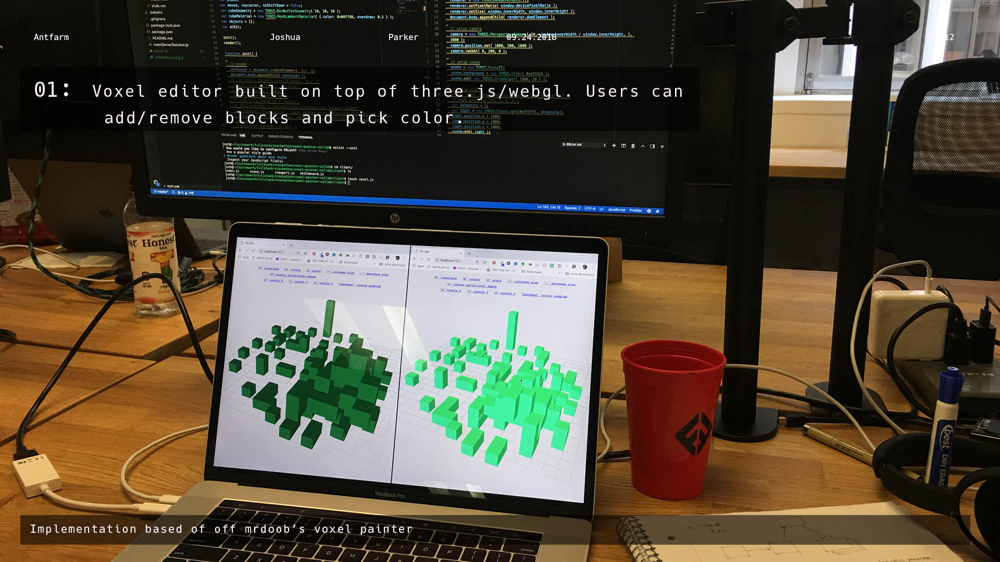

# Antfarm


Antfarm is prototype and proof-of-concept for a collaborative platform for the real-time co-creation of atomic crypto-art. It is an experiment in ownership, scarcity and authorsip in the age of microtransactions and rare pepes. 

## Demo

   
   
   
   

[antfarm.pdf](images/antfarm.pdf)

## Getting Started

### MacOS/Linux

* `npm install`
* `npm start`
* Open another terminal window; from there, `npm run seed` to seed the database

### Windows

* `npm install`
* `npm run build-watch` to start the webpack process
* Open another terminal window; from there, `npm run start-server` to start the server process
* Open another terminal window; from there, `npm run seed` to seed the database

### Dependancies

```json
"axios": "^0.15.3",
"bootstrap": "^3.3.7",
"dat.gui": "^0.7.2",
"express": "^4.14.1",
"morgan": "^1.8.1",
"pg": "^6.1.2",
"pg-hstore": "^2.3.2",
"react": "^16.2.0",
"react-dom": "^16.2.0",
"react-redux": "^5.0.7",
"react-router-dom": "^4.0.0",
"redux": "^4.0.0",
"redux-devtools-extension": "^2.13.5",
"redux-thunk": "^2.3.0",
"sequelize": "^4.4.0",
"socket.io": "^1.7.2",
"three": "^0.96.0"
```

## Contributors

**Joshua Parker** - [parkerjgit.github.io](http://parkerjgit.github.io/)

See full list of [contributors](https://github.com/your/project/contributors) who participated in this project. *Currently no contributors*

## Acknowledgements

Antfarm is the product of a 4 day sprint at [Fullstack Academy](). It includes a [voxel]() modeler (inspired and based on Mr doob's [voxel painter](https://mrdoob.com/projects/voxels/)). It was built with Three.js, React, Redux, Sequelize, PostgreSQL, and Socket.io for real-time messaging services and bi-directional transmission of shared geometry.
